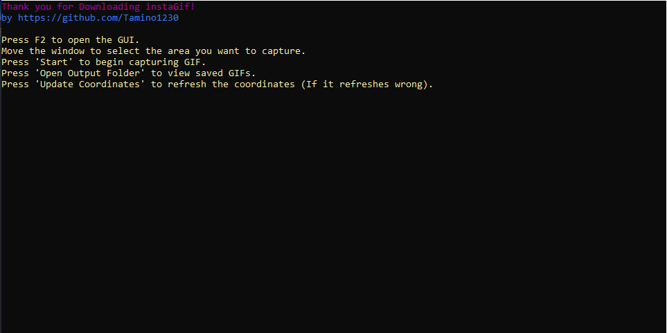
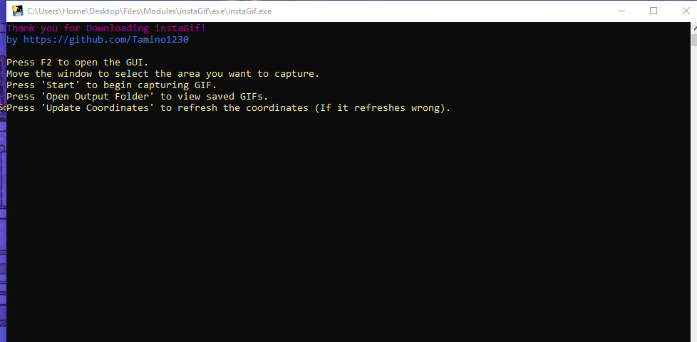
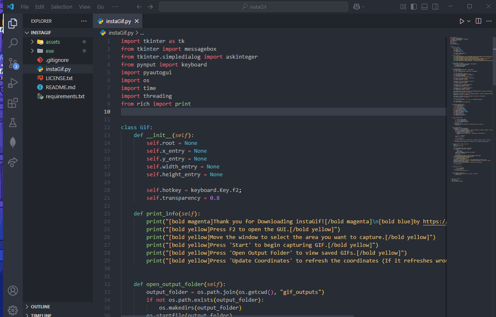
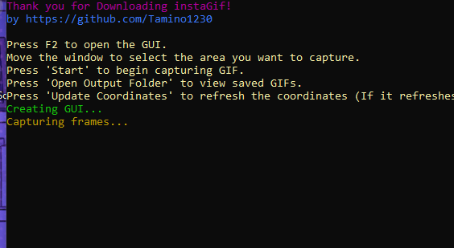

# instaGif: Instant GIF Creator
### **All Gifs in this Readme got created with "instaGif"**
<br>
<br>

instaGif is a Python-based tool that allows you to quickly capture and create GIFs from your screen. It provides a simple GUI to select the capture area and define the GIF duration.




## Features

*   **Easy Area Selection:** Use a draggable window to define the exact screen region you want to capture.
*   **Custom Duration:** Specify the length of your GIF.
*   **Hotkey Activation:** Launch the capture GUI with a simple hotkey (F2).
*   **Instant Feedback:** See the coordinates of the selected area update in real-time.
*   **Organized Output:** GIFs are saved in a dedicated `gif_outputs` folder.
*   **User-Friendly Interface:** Simple and intuitive GUI for a smooth experience.

## How to Use

1.  **Run the script or executable:**
    *   If using the Python script (`instaGif.py`), ensure you have the necessary dependencies installed (see [Dependencies](#dependencies)). Then run:
        ```bash
        python instaGif.py
        ```
    *   If using the executable (`exe/instaGif.exe`), simply double-click to run it.

2.  **Press F2:** This will open the instaGif GUI window.

    

3.  **Position and Resize the Window:** Move and resize the transparent instaGif window to cover the area of your screen you wish to record. The X, Y, Width, and Height fields will update automatically. You can also manually "Update Coordinates".

    

4.  **Start Capture:**
    *   Click the "Start" button.
    *   A dialog box will appear asking for the "GIF Duration" in seconds. Enter the desired duration and click "OK".

5.  **Capturing Process:** The GUI window will disappear, and instaGif will start capturing frames from the selected region for the specified duration. You'll see progress messages in the console if you're running the script.
    

6.  **GIF Saved:** Once the capture is complete, a message box will inform you that the GIF has been saved. The GIF will be located in the `gif_outputs` folder within the application's directory.

7.  **Open Output Folder:** You can click the "Open Output Folder" button in the GUI at any time to quickly access your saved GIFs.

You can easily send the Gifs per Webservices, etc.. (Discord can depend because of only 10Mb upload without Nitro)


## Dependencies

If you are running the Python script, you'll need the following libraries:

*   `tkinter` (usually comes with Python standard library)
*   `pynput`
*   `Pillow` (PIL Fork, used by `pyautogui` for image operations)
*   `pyautogui`
*   `rich`

You can install them using pip:

```bash
pip install pynput Pillow pyautogui rich
```
(These should also be listed in `requirements.txt`):
```bash
pip install -r requirements.txt
```

## Executable

An executable version, `instaGif.exe`, is provided in the `exe/` directory for ease of use on Windows systems without needing a Python installation (though the necessary runtime components might be bundled or required).

## Author

*   **Tamino1230**
*   GitHub: [https://github.com/Tamino1230](https://github.com/Tamino1230)

## Problems and Improvements
- in the future i will have to fix the problems:
 - that some gifs take longer to generate
 - the time isnt 100% accurate
 - some gifs may take up a lot of space
